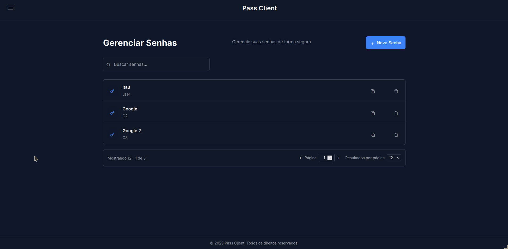

# Password Manager 🔐



Um gerenciador de senhas seguro com arquitetura **Zero-Knowledge**, garantindo que apenas o usuário tenha acesso às suas senhas - nem mesmo o servidor pode descriptografá-las.

---

## 📋 Sumário

- [Visão Geral](#visão-geral)
- [Arquitetura Zero-Knowledge](#arquitetura-zero-knowledge)
- [Stack Tecnológica](#stack-tecnológica)
- [Estrutura do Projeto](#estrutura-do-projeto)
- [Quickstart com Docker](#1-quickstart-com-docker-recomendado)
- [Rodando Localmente](#2-rodando-localmente-sem-docker)
- [Configuração](#3-variáveis-e-configuração)
- [API Reference](#api-reference)

---

## Visão Geral

Este projeto é um gerenciador de senhas completo com:

- **Microserviços .NET 10** - Backend escalável e modular
- **Gateway KrakenD** - API Gateway para roteamento e segurança
- **PostgreSQL** - Armazenamento seguro e confiável
- **Criptografia AES-256** - Proteção de dados de nível militar

---

## 🛡️ Arquitetura Zero-Knowledge

O sistema implementa uma arquitetura **Zero-Knowledge** onde o servidor **nunca** tem acesso às senhas em texto claro. Isso significa que mesmo em caso de comprometimento do banco de dados, as senhas dos usuários permanecem seguras.

### Como Funciona

```
┌─────────────────────────────────────────────────────────────────────────────┐
│                         FLUXO DE CRIAÇÃO DE USUÁRIO                         │
├─────────────────────────────────────────────────────────────────────────────┤
│                                                                             │
│  [Master Password]                                                          │
│         │                                                                   │
│         ▼                                                                   │
│  ┌──────────────┐     ┌──────────────┐                                     │
│  │  Salt (32B)  │────▶│  PBKDF2      │──────▶ [Master Derived Key]         │
│  │  (random)    │     │  (300k iter) │                                     │
│  └──────────────┘     └──────────────┘              │                      │
│                                                      ▼                      │
│                             ┌──────────────┐   ┌──────────────┐            │
│                             │  Vault Key   │   │   AES-256    │            │
│  [Vault Key] ◀──────────────│  (AES-256)   │◀──│   Encrypt    │            │
│  (random 32B)               │              │   └──────────────┘            │
│                             └──────────────┘                               │
│                                    │                                        │
│                                    ▼                                        │
│                           [Encrypted Vault Key] ──▶ 💾 Banco de Dados      │
│                                                                             │
└─────────────────────────────────────────────────────────────────────────────┘
```

### Componentes Criptográficos

| Componente                   | Algoritmo                      | Descrição                                           |
| ---------------------------- | ------------------------------ | --------------------------------------------------- |
| **Key Derivation**           | PBKDF2-SHA256 (300k iterações) | Deriva uma chave segura a partir da Master Password |
| **Criptografia de Segredos** | AES-256-CBC                    | Criptografa as senhas armazenadas                   |
| **Salt**                     | CSPRNG (32 bytes)              | Salt único por usuário para derivação de chave      |
| **IV**                       | Random (16 bytes)              | IV único por operação de criptografia               |

### Fluxo de Criptografia

#### 1. Criação de Usuário

```csharp
// Gera chave AES-256 aleatória para o vault
byte[] vaultKeyBytes = Aes.Create().Key;  // 32 bytes

// Gera salt único para o usuário
byte[] masterPasswordSalt = new byte[32];
RandomNumberGenerator.Fill(masterPasswordSalt);

// Deriva chave da Master Password usando PBKDF2
byte[] masterDerived = DeriveHelper.RFC2898(masterPassword, masterPasswordSalt);

// Criptografa a Vault Key com a chave derivada
var encryptedVaultKey = AESHelper.Encrypt(masterDerived, vaultKeyBytes);

// Armazena: salt + vault key criptografada (NUNCA a master password!)
```

#### 2. Criação de Segredo

```csharp
// Recupera salt e vault key criptografada do banco
var userSecretKey = await GetUserSecretKey(userId);

// Deriva novamente a chave da Master Password
var masterDerived = DeriveHelper.RFC2898(masterPassword, salt);

// Descriptografa a Vault Key
var vaultKey = AESHelper.Decrypt(masterDerived, encryptedVaultKey);

// Criptografa o segredo com a Vault Key
var encryptedPassword = AESHelper.Encrypt(vaultKey, passwordBytes);

// Armazena segredo criptografado no banco
```

#### 3. Leitura de Segredo

```csharp
// Mesmo processo: Master Password → Deriva → Descriptografa Vault Key
var vaultKey = ExtractVaultKey(masterPassword, salt, encryptedVaultKey);

// Descriptografa o segredo para exibição
var decryptedPassword = AESHelper.Decrypt(vaultKey, secret.Password);
```

### 🔒 Por que Zero-Knowledge?

| Aspecto                | Benefício                                                          |
| ---------------------- | ------------------------------------------------------------------ |
| **Servidor Ignorante** | O servidor nunca vê a Master Password nem as senhas em texto claro |
| **Breach Protection**  | Vazamento do banco não compromete senhas (dados cifrados)          |
| **Sem Backdoor**       | Impossível recuperar senhas sem a Master Password                  |
| **Privacidade Total**  | Apenas o usuário pode acessar seus segredos                        |

### ⚠️ O que é armazenado no banco?

| Dado                  | Formato            | Pode ser Descriptografado pelo Servidor? |
| --------------------- | ------------------ | ---------------------------------------- |
| Master Password       | **NÃO armazenada** | ❌                                       |
| Master Password Salt  | Bytes (32B)        | ❌ (não é segredo)                       |
| Password Hash (login) | bcrypt/PBKDF2      | ❌ (one-way)                             |
| Vault Key             | AES-256 encrypted  | ❌ (precisa da Master Password)          |
| Segredos (senhas)     | AES-256 encrypted  | ❌ (precisa da Vault Key)                |

---

## Stack Tecnológica

### Backend (Microserviços)

| Serviço      | Tecnologia            | Responsabilidade                         |
| ------------ | --------------------- | ---------------------------------------- |
| **Account**  | .NET 10, ASP.NET Core | Autenticação, criação de usuários, JWT   |
| **Vaultify** | .NET 10, ASP.NET Core | Gerenciamento de segredos criptografados |
| **Gateway**  | KrakenD               | Roteamento, CORS, rate limiting          |

### Bibliotecas Compartilhadas

| Lib           | Descrição                                                       |
| ------------- | --------------------------------------------------------------- |
| **Core**      | Utilitários de criptografia (AES, PBKDF2), contexts, exceptions |
| **DAL**       | Entity Framework Core, entidades, migrations, repositórios      |
| **Auth**      | Middleware JWT, serviços de token                               |
| **SharedDto** | DTOs compartilhados entre serviços                              |

### Infraestrutura

- **PostgreSQL 15** - Banco de dados relacional
- **Docker & Docker Compose** - Containerização
- **Nginx** - Proxy reverso (produção)

---

## Estrutura do Projeto

```
pass/
├── monorepo-dotnet/
│   ├── apps/
│   │   ├── account/          # Serviço de autenticação
│   │   │   └── Features/
│   │   │       ├── Auth/     # Login, JWT
│   │   │       └── Users/    # Registro de usuários
│   │   └── Vaultify/         # Serviço de segredos
│   │       └── Features/
│   │           ├── Secrets/  # CRUD de segredos
│   │           └── SecretKey/ # Gerenciamento de chaves
│   └── libs/
│       ├── core/             # Utilitários e helpers
│       │   └── Utils/
│       │       ├── AESHelper.util.cs    # Criptografia AES-256
│       │       └── DeriveHelper.util.cs # PBKDF2 key derivation
│       ├── DAL/              # Data Access Layer
│       │   ├── Entities/     # User, Secret, SecretKey
│       │   └── Repositories/ # Acesso a dados
│       ├── auth/             # JWT Middleware
│       └── SharedDto/        # DTOs compartilhados
└── devops/
    ├── docker-compose.yml    # Orquestração de containers
    └── gateway/
        └── krakend.json      # Configuração do API Gateway
```

---

## Pré-requisitos

- .NET 10 SDK (para desenvolvimento da API)
- Docker e `docker-compose` (recomendado para quickstart)
- (Opcional) `dotnet-ef` para aplicar migrations localmente

---

## 1) Quickstart com Docker (recomendado)

1. Crie um arquivo `.env` na raiz do repositório com os valores abaixo (exemplo):

```
POSTGRES_PASSWORD=postgres
CONNECTIONSTRING_POSTGRES=Host=db;Database=password_manager;Username=postgres;Password=postgres
JWT_SECRET=nG426ht60vTZ4DC1ITswuJjij8yiVoXROpxNHv9n1J4=
```

2. Suba os serviços (banco + API + gateway):

```bash
docker-compose up --build
```

3. Os serviços estarão disponíveis:

- Gateway (API Gateway): http://localhost:8080

Observação: o serviço `db` no `docker-compose` usa a variável `POSTGRES_PASSWORD` do `.env`.

---

## 2) Rodando localmente (sem Docker)

API (dotnet):

1. Garanta que um PostgreSQL esteja rodando (ex.: `localhost:5432`) e crie um banco `password_manager` com usuário `postgres`.
   - Você pode rapidamente criar um container postgres local:

```bash
docker run --name pm-db -e POSTGRES_DB=password_manager -e POSTGRES_USER=postgres -e POSTGRES_PASSWORD=postgres -p 5432:5432 -d postgres:15
```

2. Exporte variáveis de ambiente necessárias (ou ajuste `appsettings.Development.json`):

```bash
cd pass-api
export ConnectionStrings__Postgres="Host=localhost;Database=password_manager;Username=postgres;Password=postgres"
export JwtSettings__SecretKey="nG426ht60vTZ4DC1ITswuJjij8yiVoXROpxNHv9n1J4="
```

3. Restaurar e executar:

```bash
dotnet restore
dotnet run --urls=http://localhost:5000
```

4. Aplicar migrations (se desejar criar as tabelas via EF):

```bash
dotnet tool install --global dotnet-ef --version 9.0.0
dotnet ef database update
```

---

## 3) Variáveis e configuração

- As APIs leem as connection strings a partir de `ConnectionStrings:Postgres` (no `appsettings.json` ou via variáveis de ambiente `ConnectionStrings__Postgres`).
- `JWT` e outros segredos podem ser fornecidos via `JwtSettings__SecretKey` em variáveis de ambiente ou `.env` quando usando Docker.

---

## 4) Dicas e troubleshooting

- Se a API não conseguir conectar ao banco, verifique se o Postgres está rodando e se a connection string está correta.
- Para development é útil rodar o banco via Docker (comandos acima) para evitar diferenças de ambiente.
- Se usar Docker e o compose falhar devido a variáveis, verifique que o arquivo `.env` está no diretório raiz.

---

## 🔐 Segurança

### Boas Práticas Implementadas

- ✅ **PBKDF2 com 300.000 iterações** - Resistente a ataques de força bruta
- ✅ **Salt único por usuário** - Previne rainbow table attacks
- ✅ **IV aleatório por operação** - Garante unicidade de ciphertext
- ✅ **AES-256-CBC** - Criptografia de nível militar
- ✅ **Senhas nunca em texto claro** - Zero-Knowledge architecture
- ✅ **JWT para autenticação** - Tokens stateless e seguros

### Considerações

⚠️ **Master Password irrecuperável**: Se o usuário esquecer a Master Password, os segredos serão permanentemente inacessíveis.

---

## 📝 Licença

Este projeto é distribuído sob a licença MIT.
